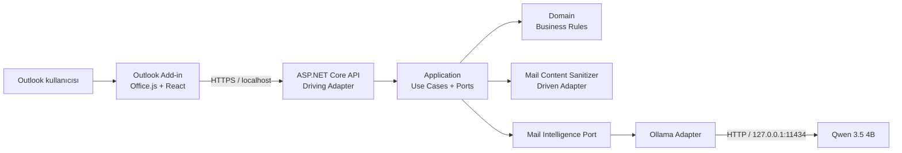
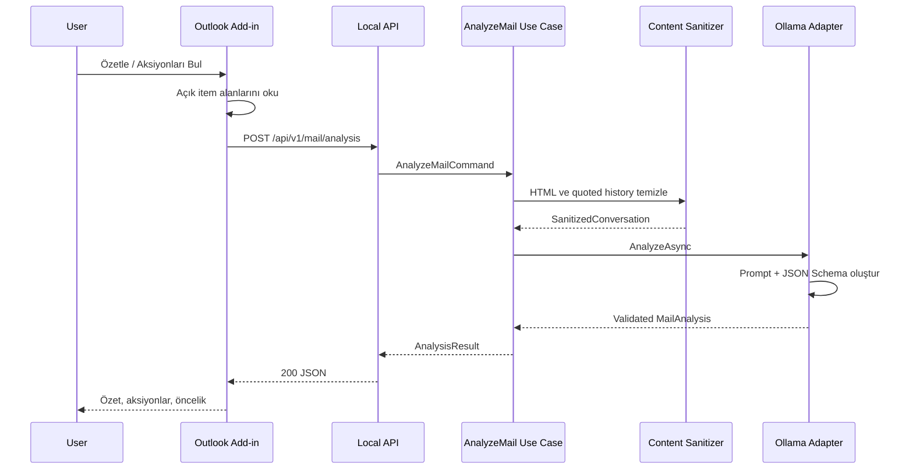

# Outlook Mail Adviser — POC Tasarımı

## 1. Amaç

Outlook'ta açık olan e-postayı varsayılan olarak makine dışına çıkarmadan analiz eden, isteğe bağlı olarak OpenAI API kullanabilen bir yardımcı geliştirmek.

POC dört kullanıcı yeteneğini doğrular:

1. **Özetle** — e-postanın kısa ve anlaşılır özetini üretir.
2. **Aksiyonları bul** — kullanıcıdan beklenen işleri, sahipleri ve tarihleri çıkarır.
3. **Cevap yaz** — seçilen tonda cevap önerisi üretir.
4. **Tonu değiştir** — mevcut taslağı kısa, diplomatik, teknik veya yönetici tonuna dönüştürür.

Oluşturulan metin yalnızca kullanıcı komutuyla Outlook taslağına aktarılır. POC hiçbir e-postayı otomatik göndermez.

## 2. POC kapsamı

### Kapsamda

- Outlook masaüstü ve Outlook Web'de sideload edilmiş task-pane eklentisi
- Açık e-postanın subject, sender, recipients, tarih ve body bilgisini Office.js ile okuma
- HTML temizleme, imza/disclaimer azaltma ve quoted-message tekrarlarını ayıklama
- Türkçe ve İngilizce e-postaları analiz etme
- Ollama'nın yerel HTTP API'sini kullanma
- JSON Schema ile yapılandırılmış model çıktısı
- Model, endpoint ve üretim parametrelerini config üzerinden değiştirme
- Kullanıcı onayıyla compose penceresine cevap taslağı yazma
- Sağlık/model erişilebilirlik kontrolü
- İçerik kaydetmeyen teknik loglama

### POC dışında

- Microsoft Graph ile mailbox veya bütün conversation history'yi çekme
- Arka planda mailbox tarama ve bildirim üretme
- Otomatik gönderim
- RAG, vektör veritabanı ve kurumsal bilgi tabanı
- Ek dosya analizi ve görsel analiz
- Çok kullanıcılı merkezi sunucu
- Model indirme/kurulum UI'ı
- Üretim dağıtımı, auto-update ve Windows service paketleme

İlk sürüm açık öğeyi ve body içinde bulunan quoted history'yi işler. Bütün Outlook conversation'ını güvenilir biçimde almak daha sonra Microsoft Graph adaptörü olarak eklenebilir.

## 3. Sistem bağlamı



Ollama'ya yalnızca backend bağlanır. Add-in doğrudan Ollama'ya erişmez; böylece prompt, schema, model parametreleri ve hata yönetimi UI'dan ayrılır.

## 4. Mimari yaklaşım

Backend Clean Architecture'ın bağımlılık kuralını uygular:

```text
Adapters/API ───────► Application ───────► Domain
Adapters/Ollama ────► Application
Adapters/Content ───► Application
```

Bağımlılıklar içeri doğru akar. Domain hiçbir framework, HTTP istemcisi, Ollama modeli veya Outlook nesnesi bilmez.

### Katman sorumlulukları

#### Domain

- E-posta konuşması ve katılımcı kavramları
- Aksiyon, öncelik, ton ve analiz sonuçları
- Değer nesnesi kuralları ve invariants
- Framework bağımsız saf iş kuralları

Önerilen temel tipler:

- `MailConversation`
- `MailMessage`
- `MailParticipant`
- `MailAction`
- `MailAnalysis`
- `ReplyDraft`
- `ReplyTone`
- `PriorityLevel`

#### Application

- Use case orchestration
- Input port'lar (commands/queries)
- Output port arayüzleri
- Domain ile adapter modelleri arasındaki mapping
- İş akışı seviyesinde validation ve cancellation
- Sonuç/hata sözleşmeleri

İlk use case'ler:

- `AnalyzeMail`
- `GenerateReply`
- `RewriteReply`
- `CheckModelStatus`

Output port'lar:

```csharp
public interface IMailContentSanitizer
{
    SanitizedConversation Sanitize(MailConversation conversation);
}

public interface IMailIntelligenceGateway
{
    Task<MailAnalysis> AnalyzeAsync(
        SanitizedConversation conversation,
        AnalysisOptions options,
        CancellationToken cancellationToken);

    Task<ReplyDraft> GenerateReplyAsync(
        SanitizedConversation conversation,
        ReplyRequest request,
        CancellationToken cancellationToken);

    Task<ReplyDraft> RewriteAsync(
        string draft,
        ReplyTone tone,
        CancellationToken cancellationToken);
}
```

Port domain odaklıdır. Ollama chat request/response tipleri Application katmanına sızmaz.

#### Adapters / Infrastructure

- `OllamaMailIntelligenceGateway`
- `HtmlMailContentSanitizer`
- JSON Schema ve prompt şablonları
- Named `HttpClient`, timeout ve hata mapping'i
- Sağlık kontrolleri
- Teknik telemetry/logging

#### API

- HTTP request/response DTO'ları
- Authentication/localhost boundary, CORS ve request-size sınırı
- Problem Details hata formatı
- Composition root ve dependency injection
- OpenAPI

#### Outlook Add-in

- Office.js item okuma/yazma adaptörü
- Task-pane React UI
- Backend API istemcisi
- Loading, retry ve kullanıcıya açıklanabilir hata durumları
- Sonucu kullanıcı onayıyla compose body'ye ekleme

## 5. Önerilen repository yapısı

```text
Outlook_Mail_Adviser/
├─ OutlookMailAdviser.sln
├─ Directory.Build.props
├─ README.md
├─ POC-DESIGN.md
├─ backend/
│  ├─ src/
│  │  ├─ OutlookMailAdviser.Domain/
│  │  ├─ OutlookMailAdviser.Application/
│  │  ├─ OutlookMailAdviser.Adapters.Ollama/
│  │  ├─ OutlookMailAdviser.Adapters.MailContent/
│  │  └─ OutlookMailAdviser.Api/
│  └─ tests/
│     ├─ OutlookMailAdviser.Domain.Tests/
│     ├─ OutlookMailAdviser.Application.Tests/
│     ├─ OutlookMailAdviser.Architecture.Tests/
│     └─ OutlookMailAdviser.Api.IntegrationTests/
├─ addin/
│  ├─ manifest.xml
│  ├─ package.json
│  ├─ src/
│  │  ├─ app/
│  │  ├─ features/
│  │  ├─ office/
│  │  ├─ api/
│  │  └─ shared/
│  └─ tests/
├─ samples/
│  └─ mails/
└─ scripts/
```

`Application` yalnızca `Domain` referansı alır. Adapter projeleri `Application` ve gerektiğinde `Domain` referansı alır. `Api`, composition root olduğu için tüm backend projelerini bir araya getirir.

## 6. Ana kullanım akışları

### 6.1 E-posta analizi



### 6.2 Cevap üretme

1. Kullanıcı ton ve yaklaşık uzunluk seçer.
2. Add-in açık e-posta bilgisini API'ye gönderir.
3. Sanitizer, model girdisini hazırlar.
4. Gateway yapılandırılmış bir `ReplyDraft` üretir.
5. Kullanıcı metni inceler ve gerekirse tonu değiştirir.
6. Kullanıcı **Taslağa ekle** dediğinde Add-in metni compose body'ye yazar.
7. Gönderme işlemi her zaman Outlook ve kullanıcının kontrolündedir.

## 7. API taslağı

### `POST /api/v1/mail/analysis`

Request:

```json
{
  "clientRequestId": "26ab75af-478c-4fa6-9cbb-8fd70d9c58ad",
  "preferredLanguage": "tr",
  "message": {
    "itemId": "optional-outlook-item-id",
    "subject": "Üretim geçiş planı",
    "from": { "name": "Ayşe", "address": "ayse@example.com" },
    "to": [{ "name": "Ali", "address": "ali@example.com" }],
    "cc": [],
    "sentAt": "2026-09-01T09:00:00+03:00",
    "body": "<html>...</html>",
    "bodyFormat": "html"
  }
}
```

Response:

```json
{
  "summary": "Üretim geçişi için onay ve tarih teyidi isteniyor.",
  "actionRequired": true,
  "actions": [
    {
      "description": "Geçiş tarihini teyit et",
      "owner": "Ali",
      "dueDate": "2026-09-03",
      "confidence": 0.88
    }
  ],
  "priority": "high",
  "sentiment": "neutral",
  "warnings": [],
  "model": "qwen3.5:4b",
  "durationMs": 4210
}
```

### `POST /api/v1/mail/replies`

Request, e-posta alanlarına ek olarak şunları içerir:

```json
{
  "tone": "diplomatic",
  "length": "short",
  "language": "tr",
  "additionalInstruction": "Cuma gününü alternatif olarak öner"
}
```

`additionalInstruction` veri kabul edilir; sistem talimatlarını geçersiz kılmasına izin verilmez ve uzunluğu sınırlandırılır.

### `POST /api/v1/mail/replies/rewrite`

```json
{
  "draft": "Mevcut cevap metni",
  "tone": "executive",
  "language": "tr"
}
```

### Sağlık uçları

- `GET /health/live` — API prosesi çalışıyor mu?
- `GET /health/ready` — Ollama erişilebilir ve configured model mevcut mu?
- `GET /api/v1/model/status` — UI için güvenli model adı/durum bilgisi

Tüm hatalar RFC 7807 Problem Details olarak döner. Mail body veya model prompt'u hata detayına/loglara konmaz.

## 8. Ollama adaptörü

Varsayılan model etiketi `qwen3.5:4b`'dir. Adaptör Ollama `/api/chat` endpoint'ini `stream: false`, `think: false` ve JSON Schema içeren `format` alanıyla çağırır. Düşünme modu ile çıktı sınırı config üzerinden değiştirilebilir.

Örnek yapılandırma:

```json
{
  "Ai": {
    "Provider": "Ollama",
    "Ollama": {
      "BaseUrl": "http://127.0.0.1:11434",
      "Model": "qwen3.5:4b",
      "TimeoutSeconds": 180,
      "Temperature": 0.1,
      "ContextWindow": 4096,
      "MaxOutputTokens": 512,
      "EnableThinking": false,
      "KeepAlive": "10m"
    }
  },
  "MailProcessing": {
    "MaxInputCharacters": 50000
  }
}
```

Kurallar:

- Kod içinde model adı bulunmaz; yalnızca config/default options sınıfında bulunur.
- `IOptionsMonitor` ile model ve üretim parametreleri yeniden başlatmadan değiştirilebilir.
- Model değişikliğinde Application/Domain veya endpoint sözleşmesi değişmez.
- Response önce JSON deserialize edilir, ardından domain kurallarıyla doğrulanır.
- Bozuk model yanıtında yalnızca bir kontrollü schema-repair denemesi yapılır.
- Timeout, model bulunamadı, Ollama kapalı ve geçersiz yanıt farklı uygulama hatalarına map edilir.
- Retry yalnızca güvenli ve geçici bağlantı hatalarında uygulanır; uzun model üretimi körlemesine tekrarlanmaz.

`Ai:Provider` değeri `Ollama` veya `OpenAI` olabilir. Composition root yalnızca seçilen `IMailIntelligenceGateway` adaptörünü ve ona ait readiness kontrolünü kaydeder.

## 9. İçerik hazırlama hattı

Model doğruluğu için ham HTML doğrudan gönderilmez:

1. `script`, `style`, tracking ve görünmez alanları kaldır.
2. HTML entity'lerini çöz ve anlamlı satır sonlarını koruyarak plain text üret.
3. Standart imza ve disclaimer bloklarını işaretle/azalt.
4. Outlook/Gmail quoted-message sınırlarını algıla.
5. Yinelenen quoted blokları hash ile tekilleştir.
6. Katılımcı, tarih ve subject metadata'sını ayrı yapılandırılmış alanlarda koru.
7. Uzunluk sınırında en yeni ve kullanıcıya en yakın içeriklere öncelik ver.
8. Prompt injection benzeri e-posta metinlerini **talimat değil veri** olarak sınırla.

POC karakter tabanlı güvenli bir sınırla başlayabilir. Token-aware truncation daha sonra adaptörün model metadata'sına göre eklenir.

## 10. Güvenlik ve gizlilik

- API yalnızca loopback adresine bind edilir.
- Ollama yalnızca `127.0.0.1` üzerinden çağrılır.
- CORS yalnızca bilinen Add-in development/production origin'lerine açıktır.
- Mail subject/body, alıcı adresleri, prompt ve model çıktısı loglanmaz.
- Request boyutu ve serbest kullanıcı talimatı sınırlandırılır.
- HTML ekrana basılırken sanitize edilir; mümkün olduğunca plain text render edilir.
- Add-in otomatik send API'si kullanmaz.
- Telemetry varsayılan olarak yalnızca süre, hata kodu, model adı ve yaklaşık input boyutu içerir.
- `appsettings.json` içinde secret bulunmaz. OpenAI anahtarı `OPENAI_API_KEY` ortam değişkeninden okunur.
- OpenAI seçildiğinde temizlenmiş e-posta içeriği makine dışına çıkar ve OpenAI API'ye gönderilir; UI bu farkı açıkça belirtir.

Loopback API başka yerel proseslere karşı tam bir güven sınırı değildir. Ürünleştirme aşamasında kurulum başına secret, kısa ömürlü nonce veya native broker değerlendirilmelidir.

## 11. Hata davranışı

UI kullanıcıya teknik stack trace yerine eyleme dönük durum gösterir:

| Durum | API davranışı | UI mesajı |
|---|---|---|
| Ollama kapalı | `503 ollama_unavailable` | Ollama'yı başlatın |
| Model yüklü değil | `503 model_not_found` | Yapılandırılan modeli indirin |
| Model timeout | `504 model_timeout` | Tekrar deneyin veya daha küçük model seçin |
| Geçersiz model JSON'u | `502 invalid_model_response` | Yanıt doğrulanamadı |
| Çok büyük içerik | sanitize/truncate + warning | Uzun içeriğin bir bölümü analiz edildi |
| Office.js item okunamadı | API çağrılmaz | E-posta içeriği okunamadı |

## 12. Test stratejisi

### Unit test

- Domain invariants ve value objects
- Analyze/Reply use case'leri, fake output port'larla
- HTML temizleme, imza/disclaimer örnekleri
- Quoted history deduplication
- Uzunluk sınırı ve Unicode/Türkçe karakterler
- Ollama error mapping ve response validation

### Architecture test

- Domain başka projeye/framework'e bağımlı olamaz.
- Application yalnızca Domain'e bağımlı olabilir.
- Adapter sınıfları Application port'larını uygulamalıdır.
- API dışındaki katmanlar ASP.NET Core controller/minimal API tiplerini kullanamaz.

### Integration test

- In-memory API + fake gateway ile endpoint contract testleri
- Sahte `HttpMessageHandler` ile Ollama request/schema doğrulama
- Opsiyonel `Category=LocalOllama` gerçek model smoke testleri

### Frontend test

- Office.js adaptörünü mock ederek item mapping
- API client ve error-state component testleri
- Draft insert işleminin yalnızca kullanıcı aksiyonuyla çağrıldığının testi

## 13. POC kabul kriterleri

1. Add-in açık bir Türkçe veya İngilizce maili okuyabilir.
2. Özet/aksiyon endpoint'i her başarılı çağrıda sözleşmeye uygun JSON döndürür.
3. Kullanıcı en az dört tondan biriyle cevap üretebilir.
4. Kullanıcı cevabı compose taslağına ekleyebilir; otomatik gönderim yoktur.
5. `qwen3.5:4b` başka bir Ollama modeliyle yalnızca config değiştirilerek değiştirilebilir.
6. Ollama kapalı ve model eksik durumları UI'da açıkça gösterilir.
7. Uygulama loglarında mail içeriği veya e-posta adresi bulunmaz.
8. Backend architecture testleri katman bağımlılıklarını korur.
9. En az 20 anonimleştirilmiş örnek mailden oluşan değerlendirme seti çalıştırılabilir.
10. Sıcak modelde hedef geliştirme makinesinde kısa mail analizi için ölçülen süre ve input boyutu raporlanır. Sabit performans eşiği donanım ölçümünden sonra belirlenir.

## 14. Geliştirme fazları

### Faz 0 — İskelet ve sınırlar

- Solution/proje yapısı
- Dependency rules ve architecture testleri
- API Problem Details, OpenAPI ve health check
- Options validation

### Faz 1 — Backend vertical slice

- Domain modelleri
- `AnalyzeMail` use case'i
- Basit HTML-to-text sanitizer
- Ollama adapter + structured output
- `/mail/analysis` endpoint'i
- Unit/integration testleri

### Faz 2 — Outlook Add-in vertical slice

- XML manifest ve local HTTPS geliştirme ortamı
- Açık item mapping
- Analysis UI
- Health/model status gösterimi

### Faz 3 — Reply akışları

- Generate/rewrite use case'leri
- Ton seçimi
- Preview ve kullanıcı onayıyla compose body'ye ekleme

### Faz 4 — Kalite ve değerlendirme

- Quoted-message dedupe ve disclaimer kuralları
- Anonimleştirilmiş evaluation seti
- Süre/doğruluk ölçümü
- Prompt/schema iyileştirme

## 15. Başlangıç kararları

| Konu | Karar |
|---|---|
| Backend | .NET 8 ASP.NET Core Web API |
| Mimari | Clean Architecture + Hexagonal ports/adapters |
| Add-in | Office.js + React + TypeScript, XML manifest |
| Yerel inference | Ollama |
| Varsayılan model | `qwen3.5:4b` (`Q4_K_M`) |
| Model çıktısı | JSON Schema structured output |
| Veri saklama | Yok |
| Mail kapsamı | Açık item + body içindeki quoted history |
| Mailbox erişimi | POC'de Microsoft Graph yok |
| Cevap gönderimi | Yalnızca kullanıcı; otomatik send yok |
| RAG | POC'de yok |

Bu kararlar POC boyunca ADR ile değiştirilebilir; ancak Domain ve Application katmanlarının sağlayıcı bağımsızlığı korunur.
