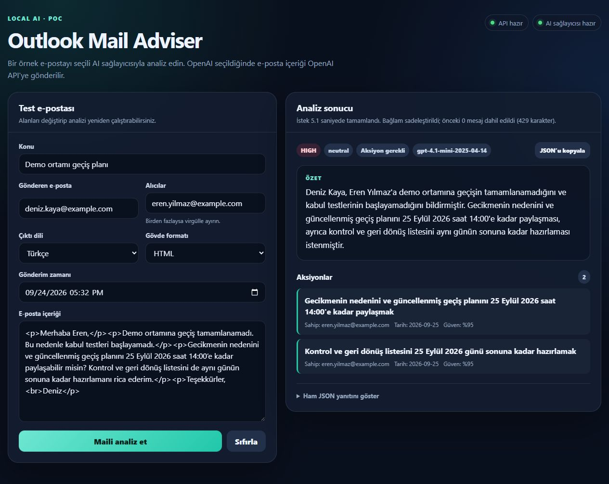

# Outlook Mail Adviser

Ahmet Almış tarafından geliştirilen, Outlook'ta açık e-postadan özet, aksiyon ve yanıt taslağı çıkaran yapay zekâ destekli **yerel portföy / POC projesi**.

## Problem ve özellikler

“Bu e-postada benden ne bekleniyor?” sorusuna Outlook'tan ayrılmadan yanıt bulmayı kolaylaştırır. Mesajın özetini, önceliğini, duygu değerlendirmesini ve tarih içeren aksiyonlarını gösterir. Kullanıcıya ait aksiyonları ayrıca vurgular. Kullanıcı yanıtın ana fikrini ve tonunu belirleyerek taslak oluşturur; son kontrol ve gönderim kullanıcıdadır. Eklenti yalnızca `ReadItem` izni ister ve otomatik e-posta göndermez.

## Teknoloji ve mimari



Görsel, uygulamanın tarayıcı test ekranından alınmıştır; Outlook task pane görüntüsü değildir.

| Katman | Teknoloji / karar |
| --- | --- |
| Outlook arayüzü | Office.js, React, TypeScript, Vite |
| Yerel API | ASP.NET Core / .NET 8 |
| Model sağlayıcıları | OpenAI (varsayılan) veya Ollama |
| Mimari | Domain/Application çekirdeği, portlar ve sağlayıcı adaptörleri |
| Kontroller | xUnit, Vitest, entegrasyon ve mimari bağımlılık testleri |

Sağlayıcı bağımlılıklarını adaptörlerde tutmak, iş kurallarını değiştirmeden OpenAI/Ollama geçişini mümkün kılar. JSON şemaları model çıktısını yapılandırır; testlerde sağlayıcılar taklit edilerek API anahtarı gereksinimi kaldırılır.
[Mimari tasarım](POC-DESIGN.md) ve [ayrıntılı geliştirme rehberi](docs/DEVELOPMENT.md).

## Veri akışı ve gizlilik

**Outlook → yerel API → seçilen model sağlayıcısı → analiz/taslak → Outlook.**

OpenAI seçildiğinde e-posta içeriği ve katılımcı bilgileri bilgisayar dışına çıkar. Kendi API anahtarınız gerekir; sağlayıcı kullanımı ücretli olabilir. Varsayılan yerel Ollama adresinde çıkarım bilgisayarınızda yapılır. HTML, imza ve geçmiş temizliği **anonimleştirme değildir**. Önce [sentetik demo](docs/DEMO.md) kullanın. Ayrıntılar: [SECURITY.md](SECURITY.md).

## Gereksinimler ve doğrulanan ortam

- Windows, PowerShell 7, Git, `global.json` ile belirtilen .NET 8 SDK.
- Node.js 22.12+ (CI: Node 22); yerel doğrulama sürümleri [yayın raporunda](docs/PUBLIC-RELEASE.md).
- Office eklentilerini ve özel manifest yüklemeyi destekleyen Outlook hesabı/istemcisi. Kurum politikaları özel eklenti yüklemeyi engelleyebilir.
- OpenAI için kendi API anahtarınız veya yerel Ollama kurulumu ve seçilen model.

Kullanıcı tarafından sağlanan önceki ekran görüntüleri klasik Windows Outlook'ta çalışan akışı gösterir. Bu yayın adayının yeniden doğrulama durumu yayın raporundadır. Yeni Outlook, Outlook Web ve macOS için doğrulanmış uyumluluk iddiası yoktur.

## Hızlı kurulum

PowerShell 7'de:

```powershell
git clone https://github.com/ahmetalmis/OutlookMailAdviser.git
cd OutlookMailAdviser
dotnet restore OutlookMailAdviser.sln --configfile NuGet.config
dotnet build OutlookMailAdviser.sln --no-restore
dotnet dev-certs https --trust
```

Sağlayıcınızı seçin; iki seçenekten yalnızca birini uygulayın:

```powershell
# OpenAI — anahtar terminal geçmişine yazılmaz.
$env:Ai__Provider = 'OpenAI'
$env:OPENAI_API_KEY = Read-Host 'OpenAI API key' -MaskInput

# Alternatif: Ollama servisi açık olmalı.
# ollama pull qwen3.5:4b
# $env:Ai__Provider = 'Ollama'

dotnet run --project backend/src/OutlookMailAdviser.Api --launch-profile https --no-build
```

Ayrı terminalde, depo kökünden:

```powershell
cd addin
npm ci
npm run certs
npm run dev
```

API `https://localhost:7047`, arayüz `https://localhost:3000` üzerinde çalışır. [Outlook'a yükleme adımlarını](addin/README.md) izleyerek `addin/manifest.xml` dosyasını yükleyin. Anahtar hiçbir `VITE_*` değişkenine yazılmaz. Yerel `.env.local` dosyası yalnızca API adresi gibi gizli olmayan frontend ayarları içindir.

Kalıcı Windows kurulumu ve kaldırma: [ayrıntılı geliştirme rehberi](docs/DEVELOPMENT.md).
Sağlayıcı değişiklikleri: [yapılandırma rehberi](PROVIDER-CONFIGURATION.md).

## Test ve güvenlik kontrolleri

```powershell
dotnet test OutlookMailAdviser.sln --no-build --no-restore
dotnet format OutlookMailAdviser.sln --no-restore --verify-no-changes
cd addin
npm test
npm run build
npm run validate
npm run validate:local-host
cd ..
./scripts/Test-Dependencies.ps1
./scripts/Install-Gitleaks.ps1
./scripts/Test-PublicSource.ps1
```

Otomatik testler gerçek modele veya API anahtarına ihtiyaç duymaz. Manifest doğrulaması, bağımlılık sorguları ve araç indirmeleri ağ erişimi gerektirir. CI aynı kontrolleri Windows üzerinde çalıştırır. Elle demo kontrolü için [sentetik senaryoyu](docs/DEMO.md) izleyin.

## Bilinen sınırlamalar

- Tek kullanıcılı yerel POC; internet erişimine açık bir servis olarak tasarlanmamıştır. CORS, kullanıcı kimlik doğrulaması değildir.
- Model çıktısı hatalı olabilir; tarihler, atamalar ve taslaklar kontrol edilmelidir.
- Bağlam en fazla 16.000 karakter; önceki iki mesaj için toplam 4.000 karakterdir. Eski konuşma bilgileri dışarıda kalabilir; uygulama kırpma/belirsizlik uyarısı gösterir.
- Ekler analiz edilmez; geçmiş ayrıca Outlook'tan indirilmez. Otomatik gönderim yoktur.
- Eksik OpenAI anahtarı başlangıç doğrulamasında bildirilir. Sağlayıcı erişilemiyor/zaman aşımı hataları sonuç yerine kullanıcıya gösterilir.
- Sentetik demo veya otomatik test başarısı, tüm Outlook sürümlerinin doğrulandığı anlamına gelmez.

## Lisans ve katkı

[MIT](LICENSE) — Copyright © 2026 Ahmet Almış.
[Üçüncü taraf lisansları ve varlık kaynakları](THIRD-PARTY-NOTICES.md).
Sorun bildirirken gerçek e-posta, kişisel veri veya API anahtarı paylaşmayın.
Güvenlik sorunları için [özel bildirim yönergesini](SECURITY.md) izleyin.
